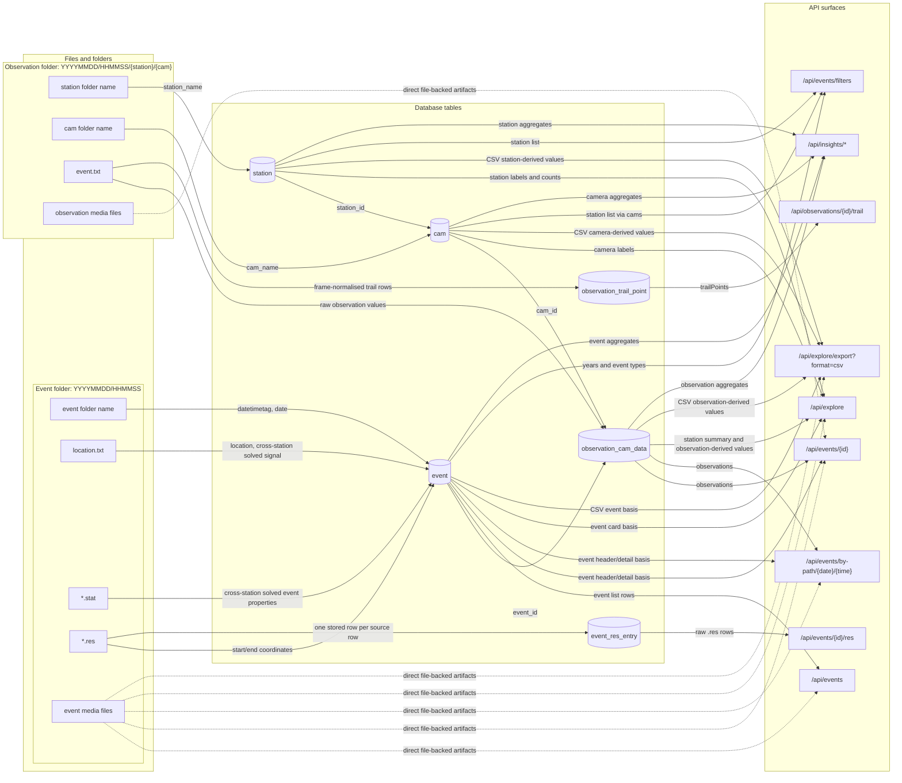

# API <-> database <-> file lineage

## Purpose
Dette dokumentet viser lineage mellom API, database og filer for backendene i dette repoet.

Maalet er aa kunne svare paa fire spoersmaal paa en standardisert maate:

1. Hvilket API-felt kommer fra hvilken databasekolonne?
2. Hvilken databasekolonne kommer fra hvilken fil, mappe eller noekkel?
3. Hvilke verdier er avledet (`derived`) og ikke direkte lest fra en kolonne?
4. Hvilke filer og kolonner finnes i systemet uten aa vaere importert til database eller eksponert i API?

FastAPI er aktiv sannhetskilde for API-kontrakt og serialisering. PHP brukes bare som referanse der navn eller payload-form fortsatt forklarer dagens kontrakt.

## Source basis
- `database/build_db.sql` definerer tabellene `user`, `station`, `cam`, `event`, `observation_cam_data`, `event_res_entry`, `observation_trail_point`, `log_station`, `user_review`.
- `fastapi_app/app/services/file_mapper.py` leser event-mappene og mapper filer til `EventRecord`, `ObservationRecord`, `ResEntryRecord`, `TrailPointRecord`.
- `fastapi_app/app/services/event_service.py` coerces filverdier til kolonnetyper, upserter database og bygger soft-delete lifecycle.
- `fastapi_app/app/utils/serialization.py` bygger API-payloads og derived felt som `title`, `event_type`, `candidate`, `preview`, `analysis`, `event_artifacts`.
- `fastapi_app/app/routers/*.py` definerer hvilke payloads som eksponeres i API-et.
- `fastapi_app/tests/test_meteor_ingestion.py` viser representative filvarianter og ingest-regler.

## Flow diagram

## Read guide
- `API field`: feltsti i request eller response. `-` betyr at raden ikke har en API-side.
- `DB source`: tabell og kolonne. Flere kolonner oppgis kommaseparert.
- `File source`: faktisk fil eller mappe. `-` betyr at raden ikke kommer fra fil.
- `File key / rule`: konkret noekkel, linje eller regel.
- `Transform`: kort regel for mapping eller avledning.
- `Status`: `direct`, `derived`, `db-only`, `file-only`, `api-only`.
- Media-URL-er i API-et skal behandles som ferdige lenker. Frontend skal ikke bygge `/meteor/...`-stier selv hvis et URL-felt mangler.
- Hoeyder i denne kontraktfamilien behandles som kilometer, hastighet som kilometer per sekund, og relevante vinkler som grader.

## Master lineage table

| Domain | Endpoint / payload | API field | DB source | File source | File key / rule | Transform | Status | Evidence |
|---|---|---|---|---|---|---|---|---|
| Event ingest | `/api/admin/event-imports` request | `date_from`, `date_to` | - | - | input payload | styrer hvilke datomapper som leses | api-only | `fastapi_app/app/routers/admin.py:16` |
| Event | `/api/events/{id}`, `/api/events`, `/api/events/by-path/{date}/{time}` | `id` | `event.id` | - | auto increment | direkte kolonne | direct | `fastapi_app/app/models/event.py:15` |
| Event | same | `event_path` | `event.datetimetag` | event folder | `YYYYMMDD/HHMMSS` | `datetimetag[:8] + "/" + datetimetag[8:]` | derived | `fastapi_app/app/services/file_mapper.py:592`, `fastapi_app/app/utils/serialization.py:603` |
| Event | same | `public_url` | `event.datetimetag` | event folder | `YYYYMMDD/HHMMSS` | bygger frontend-url fra `FRONT_URL` + `datetimetag` | derived | `fastapi_app/app/utils/serialization.py:28`, `fastapi_app/app/utils/serialization.py:609` |
| Event | same | `location` | `event.location` | `location.txt` | foerste linje | menneskelesbar stedstekst for en cross-station solved hendelse | direct | `fastapi_app/app/services/file_mapper.py:247`, `fastapi_app/app/models/event.py:17` |
| Event | same | `times.utc`, `times.local`, `times.timezone` | `event.date` | event folder | `datetimetag -> datetime` | lokal tid beregnes fra `public_timezone` | derived | `fastapi_app/app/services/file_mapper.py:594`, `fastapi_app/app/utils/serialization.py:360` |
| Event | same | `event_type` | `event.camera_confirmed`, `event.track_endheight` | `location.txt`, `*.stat`, `*.res` | filtilstedevaerelse + `endheight` | `Meteorittkandidat` hvis lav nok `track_endheight`, ellers `Krysspeilet` hvis `camera_confirmed`, ellers `Upeilet` | derived | `fastapi_app/app/utils/serialization.py:46`, `fastapi_app/app/services/file_mapper.py:241` |
| Event | same | `cross_station_confirmed` | `event.camera_confirmed` | `location.txt`, `*.stat`, `*.res` | minst en av disse finnes | boolsk av `camera_confirmed` | derived | `fastapi_app/app/services/file_mapper.py:241`, `fastapi_app/app/utils/serialization.py:607` |
| Event | same | `candidate.is_candidate`, `candidate.max_end_height_km`, `candidate.max_speed_kms` | `event.track_endheight`, `event.track_speed` | `*.stat` | `endheight`, `speed` | terskeltest mot settings | derived | `fastapi_app/app/services/file_mapper.py:283`, `fastapi_app/app/utils/serialization.py:342` |
| Event | same | `final_classification` | `event.user_confirmed` | - | - | `1 -> Meteor`, `0 -> Ikke meteor`, ellers `Usikker` | derived | `fastapi_app/app/utils/serialization.py:334` |
| Event | same | `classification.user_confirmed` | `event.user_confirmed` | - | - | direkte videresending i `classification`-wrapper; raw toppnivaa-feltet prunes, men nested feltet beholdes | direct | `fastapi_app/app/utils/serialization.py:644`, `fastapi_app/app/utils/serialization.py:505` |
| Event | same | `title` | `event.location`, `event.date`, `event.camera_confirmed`, `event.track_endheight` | `location.txt`, `*.stat`, event folder | kombinerer `event_type` med sted eller UTC-tid | bruker `location` foerst, ellers dato | derived | `fastapi_app/app/utils/serialization.py:390` |
| Event | same | `title_basis.event_type`, `title_basis.location`, `title_basis.cross_station_confirmed` | `event.camera_confirmed`, `event.track_endheight`, `event.location` | `location.txt`, `*.stat`, `*.res` | samme grunnlag som over | eksplisitt debug-/forklaringspakke for tittel | derived | `fastapi_app/app/utils/serialization.py:618` |
| Event | same | `track_startheight` | `event.track_startheight` | `*.stat` | `[track] startheight` | `.stat` er en cross-station solved event summary; `coerce_number` kan trekke ut tallet fra tekst med enhet | direct | `fastapi_app/app/services/file_mapper.py:62`, `fastapi_app/app/services/event_service.py:940` |
| Event | same | `track_endheight` | `event.track_endheight` | `*.stat` | `[track] endheight` | samme coercion-regel | direct | `fastapi_app/app/services/file_mapper.py:63`, `fastapi_app/app/services/event_service.py:972` |
| Event | same | `track_groundtrack` | `event.track_groundtrack` | `*.stat` | `[track] groundtrack` | direkte | direct | `fastapi_app/app/services/file_mapper.py:64` |
| Event | same | `track_course` | `event.track_course` | `*.stat` | `[track] course` | direkte | direct | `fastapi_app/app/services/file_mapper.py:65` |
| Event | same | `track_incidence` | `event.track_incidence` | `*.stat` | `[track] incidence` | direkte | direct | `fastapi_app/app/services/file_mapper.py:66` |
| Event | same | `track_speed` | `event.track_speed` | `*.stat` | `[track] speed` | direkte med coercion | direct | `fastapi_app/app/services/file_mapper.py:67`, `fastapi_app/app/services/event_service.py:972` |
| Event | same | `track_speed_source` | `event.track_speed_source` | `*.stat` | `[track] speed_source` | direkte tekst | direct | `fastapi_app/app/services/file_mapper.py:68` |
| Event | same | `track_startlat`, `track_startlong` | `event.track_startlat`, `event.track_startlong` | `*.res` | linje 1, token 0-1 | event-nivaaet bruker bare foerste koordinatpar paa raden; samme rad inneholder ogsaa `long2/lat2` | derived | `fastapi_app/app/services/file_mapper.py:317`, `fastapi_app/app/services/file_mapper.py:330` |
| Event | same | `track_endlat`, `track_endlong` | `event.track_endlat`, `event.track_endlong` | `*.res` | linje 2, token 0-1 | event-nivaaet bruker bare foerste koordinatpar paa raden; samme rad inneholder ogsaa `long2/lat2` | derived | `fastapi_app/app/services/file_mapper.py:318`, `fastapi_app/app/services/file_mapper.py:330` |
| Event | same | `fit_error` | `event.fit_error` | `*.stat` | `[fit] error` | direkte | direct | `fastapi_app/app/services/file_mapper.py:69` |
| Event | same | `fit_quality` | `event.fit_quality` | `*.stat` | `[fit] quality` | direkte | direct | `fastapi_app/app/services/file_mapper.py:70` |
| Event | same | `radiant_ra` | `event.radiant_ra` | `*.stat` | `[radiant] ra` | direkte | direct | `fastapi_app/app/services/file_mapper.py:71` |
| Event | same | `radiant_dec` | `event.radiant_dec` | `*.stat` | `[radiant] dec` | direkte | direct | `fastapi_app/app/services/file_mapper.py:72` |
| Event | same | `radiant_ecl_long` | `event.radiant_ecl_long` | `*.stat` | `[radiant] ecl_long` | direkte | direct | `fastapi_app/app/services/file_mapper.py:73` |
| Event | same | `radiant_ecl_lat` | `event.radiant_ecl_lat` | `*.stat` | `[radiant] ecl_lat` | direkte | direct | `fastapi_app/app/services/file_mapper.py:74` |
| Event | same | `shower`, `summary_basis.shower`, `analysis.radiant.shower` | `event.radiant_shower` | `*.stat` | `[radiant] shower` | egen branch i parser; `.stat` brukes her som solved-event summary, ikke som rå observasjonsfil | direct | `fastapi_app/app/services/file_mapper.py:297`, `fastapi_app/app/utils/serialization.py:442` |
| Event | same | `analysis.radiant.ra`, `analysis.radiant.dec` | `event.radiant_ra`, `event.radiant_dec` | `*.stat` | `ra`, `dec` | direkte viderepakking | direct | `fastapi_app/app/utils/serialization.py:469` |
| Event | same | `analysis.atmospheric_path.start_height_km`, `end_height_km`, `start_lat`, `start_lng`, `end_lat`, `end_lng`, `course_deg`, `incidence_deg`, `speed_kms` | `event.track_*` | `*.stat`, `*.res` | som over | direkte viderepakking | direct | `fastapi_app/app/utils/serialization.py:447` |
| Event | same | `analysis.atmospheric_path.geometry_points` | - | - | - | alltid `None` i dagens backend | api-only | `fastapi_app/app/utils/serialization.py:461` |
| Event | same | `analysis.orbit.*` | - | - | - | alltid `None`; ikke ingestet eller eksponert fra DB | api-only | `fastapi_app/app/utils/serialization.py:473` |
| Event | same | `analysis.artifacts`, `event_artifacts`, `preview.thumbnail_url`, `preview.image_url`, `preview.has_preview` | - | event media files | filnavn bygget fra `datetimetag` | URL-er bygges i serialisering, ikke via DB-kolonner | file-only | `fastapi_app/app/utils/serialization.py:94`, `133`, `397` |
| Event | same | `header.id`, `header.event_path`, `header.title`, `header.location`, `header.times`, `header.cross_station_confirmed` | miks av feltene over | miks | miks | wrapper rundt eksisterende felter | derived | `fastapi_app/app/utils/serialization.py:626` |
| Observation | event detail | `observations[].observation_ref.id` | `observation_cam_data.id` | - | auto increment | direkte kolonne | direct | `fastapi_app/app/utils/serialization.py:376`, `560` |
| Observation | event detail | `observations[].observation_ref.observation_key` | `observation_cam_data.observation_key` | `event.txt`, station folder, cam folder | `station:cam:event_start_utc` eller `fallback:sha256` | stabil identitet paa tvers av regrouping | derived | `fastapi_app/app/services/file_mapper.py:455` |
| Observation | event detail | `observations[].observation_ref.station_name` | `station.station_name` via `cam.station_id` | station folder | mappenavn under event | direkte | direct | `fastapi_app/app/services/event_service.py:739`, `fastapi_app/app/utils/serialization.py:377` |
| Observation | event detail | `observations[].observation_ref.cam_name` | `cam.cam_name` | cam folder | mappenavn under station | direkte | direct | `fastapi_app/app/services/event_service.py:754`, `fastapi_app/app/utils/serialization.py:377` |
| Observation | event detail | `observations[].observation_ref.event_start_utc` | `observation_cam_data.event_start_utc` | `event.txt` | `video:start` eller foerste `trail:timestamps` | parser tidspunkt fra fil | derived | `fastapi_app/app/services/file_mapper.py:443`, `fastapi_app/app/models/observation_cam_data.py:37` |
| Observation | event detail | `observations[].trail_frames`, `trail_duration`, `trail_slope`, `trail_offset`, `trail_speed`, `trail_correlation`, `trail_positions`, `trail_timestamps`, `trail_coordinates`, `trail_gnomonic`, `trail_midpoint`, `trail_arc`, `trail_brightness`, `trail_dct_midpoint`, `trail_dct`, `trail_size`, `trail_frame_brightness` | `observation_cam_data.trail_*` | `event.txt` | `[trail]` section | `event.txt` er kameranivaaets deteksjons- og målefil; `event_file_map` map + aliasstoette | direct | `fastapi_app/app/services/file_mapper.py:81`, `fastapi_app/app/models/observation_cam_data.py:44` |
| Observation | event detail | `observations[].video_start`, `video_end`, `video_wallclock`, `video_heigth`, `video_raw`, `video_flash` | `observation_cam_data.video_*` | `event.txt` | `[video]` section | `height` og `heigth` mappes til samme kolonne | direct | `fastapi_app/app/services/file_mapper.py:99`, `fastapi_app/app/models/observation_cam_data.py:61` |
| Observation | event detail | `observations[].config_*` | `observation_cam_data.config_*` | `event.txt` | `[config]` section | mange aliasformer; se appendiks | direct | `fastapi_app/app/services/file_mapper.py:105`, `fastapi_app/app/models/observation_cam_data.py:67` |
| Observation | event detail | `observations[].summary_latitude`, `summary_longitude`, `summary_elevation`, `summary_timestamp`, `summary_startpos`, `summary_endpos`, `summary_duration`, `summary_sunalt`, `summary_recalibrated`, `summary_meteor_probability` | `observation_cam_data.summary_*` | `event.txt` | `[summary]` section | direkte | direct | `fastapi_app/app/services/file_mapper.py:141`, `fastapi_app/app/models/observation_cam_data.py:107` |
| Observation | event detail | `observations[].artifacts`, `observations[].preview.thumbnail_url`, `observations[].preview.open_url`, `observations[].preview.type` | - | observation media files | bygget fra station, cam, `event_start_utc` | URL-er bygges i serialisering | file-only | `fastapi_app/app/utils/serialization.py:222`, `245`, `560` |
| Observation | event detail | `observations[].trail_point_count` | - | `event.txt` | `[trail]` section | antall lastede `trail_points` hvis relasjonen er loadet | derived | `fastapi_app/app/utils/serialization.py:563` |
| Observation | event detail | `observations[].source_hash` | `observation_cam_data.source_hash` | `event.txt` | hash av station, cam, `video_start`, `trail_timestamps`, `trail_positions` | finnes i DB men prunes bort fra offentlig payload | db-only | `fastapi_app/app/services/file_mapper.py:471`, `fastapi_app/app/utils/serialization.py:504` |
| Observation | event detail | `observations[].cam_id`, `event_id`, `cam`, `media`, `fireball_image_url`, `gnomonic_video_url` | `observation_cam_data.cam_id`, `event_id` | media files | interne felter | serialiseres kortvarig men prunes i offentlig payload | db-only | `fastapi_app/app/utils/serialization.py:560`, `496` |
| Res entries | `/api/events/{id}/res` | `resEntries[].id`, `line_no`, `entry_type`, `label`, `raw_line` | `event_res_entry.*` | `*.res` | en rad per parsebar linje | `.res` brukes som row-based solved geometry output; `entry_type` avledes fra `label` og blir i praksis `start`, `end` eller `station` | direct | `fastapi_app/app/services/file_mapper.py:335`, `351`, `fastapi_app/app/models/event_res_entry.py:17` |
| Res entries | `/api/events/{id}/res` | `resEntries[].long1`, `lat1`, `long2`, `lat2`, `height` | `event_res_entry.*` | `*.res` | samme rad: token 0-4 | begge koordinatpar leses fra samme `.res`-rad; dagens port bruker bare `long1/lat1` paa event-nivaa, mens `long2/lat2` foreloepig ser redundant eller avrundet ut | direct | `fastapi_app/app/services/file_mapper.py:350`, `fastapi_app/app/utils/serialization.py:583`, `fastapi_app/app/schemas/event.py:6` |
| Trail points | `/api/observations/{id}/trail` | `trailPoints[].frame_index`, `pixel_x`, `pixel_y`, `event_timestamp`, `coord_long`, `coord_lat` | `observation_trail_point.*` | `event.txt` | `[trail]` arrays normalisert per frame | direkte viderepakking | direct | `fastapi_app/app/services/file_mapper.py:487`, `fastapi_app/app/models/observation_trail_point.py:27`, `fastapi_app/app/schemas/event.py:397` |
| Trail points | `/api/observations/{id}/trail` | `trailPoints[].gnomonic_x`, `gnomonic_y`, `brightness`, `dct`, `size`, `frame_brightness` | `observation_trail_point.*` | `event.txt` | `[trail]` arrays normalisert per frame | serialiseres direkte fra modellen; felt er ikke eksplisitt deklarert i schemaet, men slipper gjennom fordi schemaene tillater extras | direct | `fastapi_app/app/models/observation_trail_point.py:33`, `fastapi_app/app/utils/serialization.py:587`, `fastapi_app/app/schemas/event.py:6` |
| Explore | `/api/explore` | `filters.from_date`, `to_date`, `stations`, `cross_station_confirmed`, `candidate` | - | - | query params | echo av request-filter | api-only | `fastapi_app/app/routers/events.py:252`, `fastapi_app/app/services/event_service.py:530` |
| Explore | `/api/explore` | `candidate_settings.max_end_height_km`, `max_speed_kms` | - | - | settings | hentes fra config, ikke DB | api-only | `fastapi_app/app/services/event_service.py:543` |
| Explore | `/api/explore` | `kpi.total_events`, `cross_station_confirmed`, `candidates`, `stations` | `event.*`, `observation_cam_data.*`, `station.station_name` | `location.txt`, `*.stat`, `*.res`, `event.txt`, folders | aggregerer serialiserte event payloads | derived | `fastapi_app/app/services/event_service.py:520` |
| Explore | `/api/explore` | `events[].id`, `event_path`, `title`, `times`, `location`, `cross_station_confirmed`, `candidate`, `shower`, `technical_validity`, `station_summary`, `preview`, `final_classification` | miks av `event`, `observation_cam_data`, `station`, `cam` | miks | bygger kortversjon av event payload | derived | `fastapi_app/app/services/event_service.py:549` |
| Explore | `/api/explore` | `events[].ai_score`, `events[].ground.slat`, `events[].ground.slng` | - | - | - | alltid `None` i dagens kode | api-only | `fastapi_app/app/services/event_service.py:560` |
| Explore CSV | `/api/explore/export?format=csv` | `id`, `event_path`, `title`, `utc_time`, `local_time`, `location`, `cross_station_confirmed`, `is_candidate`, `max_end_height_km`, `max_speed_kms`, `station_count`, `observation_count`, `shower`, `ra`, `dec`, `lat`, `lng`, `final_classification` | samme som `/api/explore` | samme som `/api/explore` | skriver ut utvalgte felter fra explore-payload | derived | `fastapi_app/app/services/event_service.py:578` |
| Filters | `/api/events/filters` | `years` | `event.date` | event folder | `datetimetag -> year` | `extract(year from Event.date)` | derived | `fastapi_app/app/services/event_service.py:447` |
| Filters | `/api/events/filters` | `stations` | `station.station_name` | station folder | distinct join via `cam` og `observation_cam_data` | derived | `fastapi_app/app/services/event_service.py:454` |
| Filters | `/api/events/filters` | `eventTypes` | `event.camera_confirmed`, `event.track_endheight` | `location.txt`, `*.stat`, `*.res` | samme regel som `event_type` | distinct case-uttrykk i SQL | derived | `fastapi_app/app/services/event_service.py:462` |
| Insight | `/api/insights/cam`, `/api/insights/station`, `/api/insights/total` | rapportfelter som `Stasjonsnavn`, `Kameranavn`, `Hendelser`, `Krysspeilede`, `Meteorittkandidater` | `station`, `cam`, `observation_cam_data`, `event` | station folder, cam folder, `*.stat`, `*.res`, `event.txt` | SQL aggregasjoner over joinet datasett | derived | `fastapi_app/app/services/event_service.py:347` |
| Insight | `/api/insights/coordinates` | `lat`, `lng` | `event.track_endlat`, `event.track_endlong` | `*.res` | linje 2, token 0-1 | direkte SQL-uttrekk av event-feltene som ble satt fra foerste koordinatpar paa andre rad | direct | `fastapi_app/app/services/event_service.py:429`, `fastapi_app/app/services/file_mapper.py:318` |
| Review | `POST /api/events/{id}/review` | `eventID`, `userID`, `confirmed` | `user_review.event_id`, `user_review.user_id`, `user_review.confirmed` | - | payload + auth token | `Positive/1 -> 1`, `Negative/0 -> 0`, ellers `-1` | direct | `fastapi_app/app/routers/events.py:156`, `fastapi_app/app/services/event_service.py:334` |
| Review | `POST /api/events/{id}/review` response | `msg` | `user_review.confirmed` | - | - | ren tekst bygget fra rating | derived | `fastapi_app/app/routers/events.py:174` |
| Classification | `PUT /api/events/{id}/classification` | `id`, `user_confirmed` | `event.id`, `event.user_confirmed` | - | payload | samme `Positive/Negative/1/0` mapping | direct | `fastapi_app/app/routers/events.py:184`, `fastapi_app/app/services/event_service.py:348` |
| Auth | `POST /api/auth/login` | `identifier` | `user.username` | - | request payload | lookup case-insensitive mot brukerkontoens identifier; dagens runtime aksepterer ogsaa eldre `username` i request body | direct | `fastapi_app/app/routers/auth.py:18`, `fastapi_app/app/services/user_service.py:30` |
| Auth | `POST /api/auth/login` | `password` | `user.password` | - | request payload | verifiseres mot hash; ikke returnert | db-only | `fastapi_app/app/services/user_service.py:35` |
| Auth | `POST /api/auth/login` response | `token`, `accessToken` | `user.id`, `user.username`, `user.role`, `user.user_level` | - | JWT claims | token bygges i kode, lagres ikke i DB | api-only | `fastapi_app/app/routers/auth.py:27` |
| Auth | `POST /api/auth/login` response | `id`, `email`, `identifier`, `user_role`, `roles`, `user_level`, `tutorial_completed`, `account_confirmed` | `user.id`, `username`, `role`, `user_level`, `tutorial_completed`, `confirmed` | - | - | direkte/lett wrapper med offentlig naming-linje | direct | `fastapi_app/app/routers/auth.py:34` |
| Auth | `GET /api/auth/verification/confirm` | `token` | `user.confirm_token` | - | query param | matcher bekreftelsestoken mot bruker og setter `confirmed=true` ved treff | direct | `fastapi_app/app/routers/auth.py`, `fastapi_app/app/services/user_service.py` |
| Auth | `GET /api/auth/verification/confirm` response | `message`, `account_confirmed` | `user.confirmed` | - | - | bekrefter konto og nullstiller `confirm_token` | direct | `fastapi_app/app/routers/auth.py`, `fastapi_app/app/services/user_service.py` |
| Auth | `POST /api/auth/verification/resend` | `email` | `user.username` | - | payload | bruker e-post som kontoidentifier ved ny utsending | direct | `fastapi_app/app/routers/auth.py`, `fastapi_app/app/services/user_service.py` |
| Auth | `POST /api/auth/verification/resend` response | `message` | - | - | - | nøytral respons selv om konto ikke finnes | api-only | `fastapi_app/app/routers/auth.py` |
| Password reset | `POST /api/auth/password-reset/request` | `email` | `user.username` | - | payload | case-insensitive user lookup | direct | `fastapi_app/app/routers/auth.py:43`, `fastapi_app/app/services/user_service.py:92` |
| Password reset | same | `password_reset_token`, `password_reset_request_time` | `user.password_reset_token`, `user.password_reset_request_time` | - | generated | skrives til DB, men eksponeres ikke i API | db-only | `fastapi_app/app/services/user_service.py:98`, `fastapi_app/app/models/user.py:20` |
| User | `POST /api/users` | `identifier`, `password` | `user.username`, `user.password` | - | payload | request bruker offentlig navnet `identifier`, men lagres i intern kolonne `user.username`; password hashes foer lagring | direct | `fastapi_app/app/routers/users.py:18`, `fastapi_app/app/services/user_service.py:19` |
| User | `POST /api/users` side effect | `confirm_token`, `confirmed` | `user.confirm_token`, `user.confirmed` | - | generated | ny bruker opprettes med `confirm_token` for e-postverifisering; kontoen er ikke bekreftet ennå | db-only | `fastapi_app/app/services/user_service.py` |
| User | `GET /api/users/{id}`, `/api/users`, `PATCH /api/users/{id}`, `PUT /api/users/{id}/tutorial-completion`, `PATCH /api/users/{id}/password` | `id`, `identifier`, `user_role`, `roles`, `user_level`, `tutorial_completed`, `account_confirmed` | `user.id`, `username`, `role`, `user_level`, `tutorial_completed`, `confirmed` | - | `serialize_user` wrapper med offentlig navn `identifier` og `account_confirmed` | direct | `fastapi_app/app/utils/serialization.py:533` |
| User | `GET /api/users/{id}/reviews` | `reviews[].event_id`, `event_path`, `location`, `confirmed`, `review_label` | `user_review.event_id`, `user_review.confirmed`, `event.datetimetag`, `event.location` | event folder | `datetimetag -> event_path` | viser profilens vurderingshistorikk som join mellom `user_review` og `event` | direct | `fastapi_app/app/routers/users.py`, `fastapi_app/app/services/user_service.py` |
| Tutorial | `GET /api/tutorial` | `version`, `content_owner`, `delivery_surface`, `status_field`, `completion_route`, `minimum_level_after_completion` | - | frontend tutorial files | `frontend-branch/ildkule-frontend/src/components/UserTutorialModal.vue` | backend eier bare metadata og statuslinje; selve tutorialteksten, media og språk eies av frontend | api-only | `fastapi_app/app/routers/users.py`, `frontend-branch/ildkule-frontend/src/components/UserTutorialModal.vue`, `frontend-branch/ildkule-frontend/src/views/Brukerprofil/Brukerprofil.vue` |
| User | `/api/users` | `ratings`, `positive_ratings`, `negative_ratings` | `user_review.confirmed`, `user_review.user_id` | - | group by `UserReview` | derived | `fastapi_app/app/services/user_service.py:53` |
| User | all public user responses | `password`, `confirm_token`, `password_reset_token` | `user.password`, `confirm_token`, `password_reset_token` | - | - | finnes i DB men prunes i `serialize_user` | db-only | `fastapi_app/app/utils/serialization.py:534` |
| Forms | `POST /api/forms/contact` | `rcToken`, `form.fornavn`, `form.etternavn`, `form.epost`, `form.melding` | - | - | payload only | brukes kun til reCAPTCHA + SMTP | api-only | `fastapi_app/app/schemas/contact.py:7`, `fastapi_app/app/services/contact_service.py:10` |
| Forms | `POST /api/forms/meteor-report` | `rcToken`, `form.*`, `attachments` | - | uploaded files | multipart `attachments/files/attachment` | brukes kun til reCAPTCHA + SMTP | file-only | `fastapi_app/app/routers/forms.py:34`, `fastapi_app/app/services/contact_service.py:41` |
| Station log | `POST /api/station-logs` | `station.name`, `station.code`, `station.log_time` | `log_station.station_name`, `code`, `log_time` | - | payload | direkte insert | direct | `fastapi_app/app/routers/logs.py:19`, `fastapi_app/app/services/log_service.py:7` |
| Station log | `GET /api/station-logs` | `id`, `station_name`, `code`, `log_time`, `created_at` | `log_station.*` | - | - | direkte rå loggrader fra `log_station`; dette er ikke den rikere stasjons- og kamerastatusflaten | direct | `fastapi_app/app/routers/logs.py:14`, `fastapi_app/app/models/log_station.py:11` |
| Station network | `GET /api/station-network` | `offline_after_minutes`, `stations[].station_name`, `last_seen`, `connected`, `camera_count`, `cameras[].cam_name`, `last_seen`, `connected`, `snapshot_url`, `last_image_url` | `station.station_name`, `cam.cam_name`, `log_station.log_time`, `observation_cam_data.event_start_utc`, `observation_cam_data.created` | station folder, cam folder, observation media | bruker siste stasjonslogg og siste observasjon per kamera; snapshot-url bygges fra `station_snapshot_base_url` eller siste bilde | derived | `fastapi_app/app/routers/logs.py`, `fastapi_app/app/services/log_service.py`, `fastapi_app/app/utils/serialization.py` |
| DB lifecycle | - | - | `event.first_seen_at`, `last_seen_at`, `deleted_at`, `is_deleted`, `deletion_reason` | - | import lifecycle | brukes til sync og soft-delete, ikke offentlig i API | db-only | `fastapi_app/app/models/event.py:42`, `fastapi_app/app/services/event_service.py:830` |
| DB lifecycle | - | - | `observation_cam_data.created`, `first_seen_at`, `last_seen_at`, `deleted_at`, `is_deleted`, `deletion_reason` | - | import lifecycle | brukes til sync og soft-delete, ikke offentlig i API | db-only | `fastapi_app/app/models/observation_cam_data.py:38`, `fastapi_app/app/services/event_service.py:781` |
| DB structure | - | - | `station.id`, `station.station_name`, `cam.id`, `cam.station_id`, `cam.cam_name` | station/cam folders | mappenavn | tabellene brukes indirekte i joins og observation identity, ikke som egne offentlige endpoints | db-only | `fastapi_app/app/models/station.py:13`, `fastapi_app/app/models/cam.py:13` |

## Files present but not ingested into database

| File or pattern | Level | Used in API | Stored in DB | How it is used today | Evidence |
|---|---|---|---|---|---|
| `image.jpg` | event | yes | no | `event_artifacts`, `preview.image_url` | `fastapi_app/app/utils/serialization.py:94`, `110` |
| `thumbnail.jpg` | event | yes | no | `preview.thumbnail_url`; generated locally fra `image.jpg` | `fastapi_app/app/services/file_mapper.py:257`, `fastapi_app/app/utils/serialization.py:94` |
| `map.jpg`, `map.svg` | event | yes | no | artifakt-URL for trajectory map | `fastapi_app/app/utils/serialization.py:118`, `148` |
| `posvstime.jpg`, `posvstime.svg` | event | yes | no | artifakt-URL for position vs time | `fastapi_app/app/utils/serialization.py:121`, `163` |
| `spd_acc.jpg`, `spd_acc.svg` | event | yes | no | artifakt-URL for speed/acceleration | `fastapi_app/app/utils/serialization.py:123`, `155` |
| `orbit.jpg`, `orbit.svg` | event | yes | no | artifakt-URL for orbit visual | `fastapi_app/app/utils/serialization.py:125`, `170` |
| `height.jpg`, `height.svg` | event | yes | no | artifakt-URL for height profile | `fastapi_app/app/utils/serialization.py:127`, `178` |
| `obs_YYYY-MM-DD_HH_MM_SS.txt` | event | yes | no | download-link til analysedokument | `fastapi_app/app/utils/serialization.py:38`, `186` |
| `obs_YYYY-MM-DD_HH_MM_SS.kml` | event | yes | no | download-link til KML | `fastapi_app/app/utils/serialization.py:39`, `194` |
| `stations.html` | event | yes | no | interaktiv analyse-artifakt | `fastapi_app/app/utils/serialization.py:40`, `202` |
| `tables.html` | event | yes | no | interaktiv analyse-artifakt | `fastapi_app/app/utils/serialization.py:41`, `210` |
| `fireball.jpg` | observation | yes | no | observation preview | `fastapi_app/app/utils/serialization.py:234`, `255` |
| `<station>-<timestamp>.jpg` | observation | yes | no | raw image URL | `fastapi_app/app/utils/serialization.py:234`, `263` |
| `<station>-<timestamp>.mp4` | observation | yes | no | raw video URL | `fastapi_app/app/utils/serialization.py:206`, `271` |
| `<station>-<timestamp>-gnomonic.jpg` | observation | yes | no | processed image URL | `fastapi_app/app/utils/serialization.py:208`, `279` |
| `<station>-<timestamp>-gnomonic.mp4` | observation | yes | no | processed video URL | `fastapi_app/app/utils/serialization.py:210`, `287` |
| `brightness.jpg`, `fbrightness.jpg`, `size.jpg` | observation | yes | no | graf-artifakter | `fastapi_app/app/utils/serialization.py:212`, `295` |
| uploaded form attachments | report form | no public retrieval | no | sendes videre som e-postvedlegg | `fastapi_app/app/routers/forms.py:65`, `fastapi_app/app/services/contact_service.py:50` |

## Database columns not exposed in public API

| Table | Column(s) | Why missing from public API | Evidence |
|---|---|---|---|
| `event` | `camera_confirmed` | raw kolonnen prunes bort; API bruker i stedet `cross_station_confirmed`, `event_type` og `classification.cross_station_confirmed` | `fastapi_app/app/utils/serialization.py:505`, `606`, `644` |
| `event` | `create_time`, `first_seen_at`, `last_seen_at`, `deleted_at`, `is_deleted`, `deletion_reason` | import metadata og lifecycle, ikke offentlig kontrakt | `fastapi_app/app/models/event.py:18`, `42` |
| `observation_cam_data` | `source_hash` | intern identitet/fallback, ikke offentlig | `fastapi_app/app/models/observation_cam_data.py:36`, `fastapi_app/app/utils/serialization.py:496` |
| `observation_cam_data` | `cam_id`, `event_id` | intern relasjonskobling; API viser heller `observation_ref` | `fastapi_app/app/models/observation_cam_data.py:33`, `35`, `fastapi_app/app/utils/serialization.py:503` |
| `observation_cam_data` | `created`, `first_seen_at`, `last_seen_at`, `deleted_at`, `is_deleted`, `deletion_reason` | import metadata og lifecycle | `fastapi_app/app/models/observation_cam_data.py:38` |
| `event_res_entry` | - | ingen bekreftede DB-only-kolonner akkurat naa; numeriske felter ser ut til aa slippe gjennom runtime selv om schemaet ikke deklarerer dem eksplisitt | `fastapi_app/app/utils/serialization.py:583`, `fastapi_app/app/schemas/event.py:6` |
| `observation_trail_point` | - | ingen bekreftede DB-only-kolonner akkurat naa; ekstra felt ser ut til aa slippe gjennom runtime selv om schemaet ikke deklarerer dem eksplisitt | `fastapi_app/app/utils/serialization.py:587`, `fastapi_app/app/schemas/event.py:6` |
| `user` | `password`, `confirm_token`, `password_reset_token`, `password_reset_request_time`, `update_time` | sensitivt eller internt | `fastapi_app/app/models/user.py:14`, `19`, `23`, `fastapi_app/app/utils/serialization.py:534` |
| `station` | `id`, `created` | `station_name` eksponeres via `observation_ref` og `station_summary`; `id` og `created` er fortsatt interne | `fastapi_app/app/models/station.py:13`, `fastapi_app/app/utils/serialization.py:371`, `407` |
| `cam` | `id`, `station_id`, `created` | `cam_name` eksponeres via `observation_ref` og `station_summary`; resten er interne koblingsfelter | `fastapi_app/app/models/cam.py:13`, `fastapi_app/app/utils/serialization.py:371`, `407` |
| `user_review` | hele tabellen | brukes til ratinger og review-oppdatering, men har ingen egen offentlig list/detail response | `database/build_db.sql:324`, `fastapi_app/app/services/event_service.py:334` |

## Observed redundancy and control points

### Potentially redundant fields

| Area | Field(s) | Why it looks redundant today | Evidence |
|---|---|---|---|
| `.res` -> `event` | `event.track_startlat`, `event.track_startlong` vs `event_res_entry` line 1 `long1`, `lat1` | event-feltene er kopi av foerste koordinatpar paa foerste `.res`-rad | `fastapi_app/app/services/file_mapper.py:317`, `fastapi_app/app/services/file_mapper.py:347` |
| `.res` -> `event` | `event.track_endlat`, `event.track_endlong` vs `event_res_entry` line 2 `long1`, `lat1` | event-feltene er kopi av foerste koordinatpar paa andre `.res`-rad | `fastapi_app/app/services/file_mapper.py:318`, `fastapi_app/app/services/file_mapper.py:347` |
| `.res` row shape | `long2`, `lat2` vs `long1`, `lat1` | begge koordinatpar kommer fra samme rad; i observerte fixtures ser andre par ut som avrundet eller redundant variant | `fastapi_app/tests/test_meteor_ingestion.py:203`, `257` |
| Event payload | `header.*` vs toppnivaa `id`, `event_path`, `title`, `location`, `times`, `cross_station_confirmed` | `header` er en wrapper rundt felt som allerede finnes paa toppnivaa | `fastapi_app/app/utils/serialization.py:630` |
| Event payload | `classification.cross_station_confirmed` vs toppnivaa `cross_station_confirmed` | samme verdi publiseres to steder | `fastapi_app/app/utils/serialization.py:607`, `644` |
| Event payload | `summary_basis.location`, `summary_basis.station_summary`, `summary_basis.shower`, `summary_basis.candidate` | samme grunnlagsfelt finnes ogsaa paa toppnivaa | `fastapi_app/app/utils/serialization.py:638` |
| Event payload | `station_count`, `observation_count` vs `station_summary.station_count`, `station_summary.observation_count` | toppnivaa-feltene er kopier av verdier i `station_summary` | `fastapi_app/app/utils/serialization.py:624`, `625` |
| Event payload | `event_artifacts` vs `analysis.artifacts` | samme artefaktliste ligger i to payload-steder | `fastapi_app/app/utils/serialization.py:613`, `652` |
| Observation payload | `trail_*` raw arrays vs `/api/observations/{id}/trail` normaliserte `trailPoints[]` | samme kildeinnhold lagres baade som raatekst i `observation_cam_data` og som frame-normaliserte rader | `fastapi_app/app/models/observation_cam_data.py:44`, `fastapi_app/app/models/observation_trail_point.py:27` |

### Known ingestion and parser gaps

| Source | Gap or ambiguity | Current behavior | Evidence |
|---|---|---|---|
| `location.txt` | flere tekstlinjer | bare foerste linje leses inn til `event.location`; resten ignoreres | `fastapi_app/app/services/file_mapper.py:253` |
| `event.txt` | ukjente nøkler | nøkler som ikke finnes i `event_file_map` ignoreres stille | `fastapi_app/app/services/file_mapper.py:436` |
| `event.txt` | dupliserte nøkler | siste observerte verdi vinner hvis samme mapte felt kommer flere ganger | `fastapi_app/app/services/file_mapper.py:418` |
| `*.stat` | flere filer i samme event-mappe | bare foerste `.stat`-fil brukes | `fastapi_app/app/services/file_mapper.py:284`, `287` |
| `*.stat` | ukjente nøkler eller seksjoner | bare nøkler i `stat_file_map` pluss spesialtilfellet `shower` leses inn; resten ignoreres | `fastapi_app/app/services/file_mapper.py:292` |
| `*.stat` | lange `shower`-navn | parseren joiner bare et begrenset tokenutvalg for `shower`, saa veldig lange navn kan bli trunkert | `fastapi_app/app/services/file_mapper.py:295` |
| `*.res` | flere filer i samme event-mappe | bare foerste `.res`-fil brukes | `fastapi_app/app/services/file_mapper.py:310`, `313` |
| `*.res` | filer med mindre enn to linjer | event-nivaaets start/slutt-koordinater settes ikke; hele `.res`-innlesingen returnerer tom liste | `fastapi_app/app/services/file_mapper.py:319` |
| `*.res` | rader med for faa tokens | rader med faerre enn seks tokens blir ikke til `event_res_entry` | `fastapi_app/app/services/file_mapper.py:355` |
| `*.res` | ekstra tokens utover standardrad | parseren lagrer bare token 0-4 og `label`; eventuell ekstra struktur beholdes bare i `raw_line` | `fastapi_app/app/services/file_mapper.py:350` |
| Public schema control | implisitt eksponering av extras | flere felt slipper gjennom fordi Pydantic-basisskjemaene tillater extras, selv om de ikke er eksplisitt deklarert i schemaet | `fastapi_app/app/schemas/event.py:6`, `fastapi_app/app/utils/serialization.py:583`, `587` |

## Files ingested into database

| File or folder | DB target | Mapping rule | Evidence |
|---|---|---|---|
| `YYYYMMDD/HHMMSS` | `event.datetimetag`, `event.date` | foldernavn concatenates til `datetimetag`, parses til datetime | `fastapi_app/app/services/file_mapper.py:585` |
| `location.txt` | `event.location`, indirekte `event.camera_confirmed` | foerste linje -> menneskelesbar stedstekst; filtilstedevaerelse setter cross-station solved signal | `fastapi_app/app/services/file_mapper.py:235` |
| `*.stat` | `event.track_*`, `fit_*`, `radiant_*`, `timestamp` | cross-station solved event summary via `stat_file_map`; observerte filer bruker seksjoner som `[track]`, `[fit]`, `[radiant]`, `[date]` | `fastapi_app/app/services/file_mapper.py:62`, `276`, `fastapi_app/tests/test_meteor_ingestion.py:170` |
| `*.res` | `event.track_start*`, `event.track_end*`, `event_res_entry.*` | cross-station solved trajectory rows; linje 1 og 2 setter event-koordinater fra token 0-1; samme rader lagres ogsaa fullt som `event_res_entry` med token 0-4 og `label` som `start`, `end` eller `station` | `fastapi_app/app/services/file_mapper.py:300`, `fastapi_app/app/services/file_mapper.py:347`, `fastapi_app/app/services/file_mapper.py:376` |
| `station` folder name | `station.station_name` | mappenavn | `fastapi_app/app/services/event_service.py:739` |
| `cam` folder name | `cam.cam_name`, `cam.station_id` | mappenavn under station | `fastapi_app/app/services/event_service.py:754` |
| `station/cam/event.txt` | `observation_cam_data.*`, `observation_trail_point.*`, `observation_key`, `source_hash`, `event_start_utc` | `event_file_map`, `_build_trail_points`, `_build_observation_key`, `_build_source_hash` | `fastapi_app/app/services/file_mapper.py:380`, `455`, `471`, `487` |

## Appendix A: accepted `event.txt` key variants

| Source key | DB column | Note | Evidence |
|---|---|---|---|
| `trail:correlation`, `trail:correlation1` | `trail_correlation` | to varianter map til samme kolonne | `fastapi_app/app/services/file_mapper.py:87` |
| `trail:dct_midpoint`, `trail:dct midpoint` | `trail_dct_midpoint` | med og uten underscore | `fastapi_app/app/services/file_mapper.py:94` |
| `video:heigth`, `video:height` | `video_heigth` | kildefeil/stavevariant beholdes i DB-navn | `fastapi_app/app/services/file_mapper.py:100` |
| `config:minspeed_kms`, `config:minspeedkms` | `config_minspeed_kms` | alias | `fastapi_app/app/services/file_mapper.py:112` |
| `config:maxspeed_kms`, `config:maxspeedkms` | `config_maxspeed_kms` | alias | `fastapi_app/app/services/file_mapper.py:114` |
| `config:spacing_correlation`, `config:spacing correlation` | `config_spacing_correlation` | alias | `fastapi_app/app/services/file_mapper.py:124` |
| `config:gnomonic_correlation`, `config:gnomonic correlation` | `config_gnomonic_correlation` | alias | `fastapi_app/app/services/file_mapper.py:126` |
| `config:log_file`, `config:logfile` | `config_log_file` | alias | `fastapi_app/app/services/file_mapper.py:132` |
| `config:mask_file`, `config:maskfile` | `config_mask_file` | alias | `fastapi_app/app/services/file_mapper.py:134` |
| `config:max_file`, `config:maxfile` | `config_max_file` | alias | `fastapi_app/app/services/file_mapper.py:136` |
| `config:save_file`, `config:savefile` | `config_save_file` | alias | `fastapi_app/app/services/file_mapper.py:138` |
| `config:pto_file`, `config:ptofile` | `config_pto_file` | alias | `fastapi_app/app/services/file_mapper.py:140` |
| `config:pto_scale`, `config:ptoscale` | `config_pto_scale` | alias | `fastapi_app/app/services/file_mapper.py:142` |
| `config:pto_width`, `config:ptowidth` | `config_pto_width` | alias | `fastapi_app/app/services/file_mapper.py:144` |
| `config:pto_height`, `config:ptoheight` | `config_pto_height` | alias | `fastapi_app/app/services/file_mapper.py:146` |
| `config:event_dir`, `config:eventdir` | `config_event_dir` | alias | `fastapi_app/app/services/file_mapper.py:149` |
| `frames`, `duration`, `latitude`, `longitude` | `trail_frames`, `trail_duration`, `summary_latitude`, `summary_longitude` | fallback for eldre enkle `event.txt`-varianter uten sections | `fastapi_app/app/services/file_mapper.py:154` |

## Appendix B: coercion and normalization rules

| Rule | What it does | Evidence |
|---|---|---|
| `_coerce_number` | finner foerste token som kan parses som tall; erstatter komma med punktum; ignorerer resten av teksten | `fastapi_app/app/services/event_service.py:972` |
| `_coerce_datetime` | prover parser fra `event.txt` format, deretter `%Y-%m-%d %H:%M:%S` og `%Y-%m-%d` | `fastapi_app/app/services/event_service.py:957` |
| `_build_observation_key` | bruker `station:cam:event_start_utc` hvis mulig, ellers `fallback:<sha256>` | `fastapi_app/app/services/file_mapper.py:455` |
| `_build_source_hash` | hasher station, cam, `video_start`, `trail_timestamps`, `trail_positions` | `fastapi_app/app/services/file_mapper.py:471` |
| `_build_trail_points` | lager radvis trail-data med `common_length = min(len(seq))` for tilgjengelige sekvenser | `fastapi_app/app/services/file_mapper.py:487` |
| `_sync_import_columns` | ved reimport overskrives alle kildeavledede `event`- og `observation_cam_data`-felter; verdier som ikke lenger finnes i filene settes til `NULL` i stedet for å bli hengende igjen | `fastapi_app/app/services/event_service.py:938` |
| `_mark_missing_events_deleted`, `_mark_missing_observations_deleted` | markerer rader som ikke finnes i siste importvindu som `is_deleted = true` og `deletion_reason = missing_from_import` | `fastapi_app/app/services/event_service.py:830`, `854` |

## Appendix C: PHP parity notes
- `api/src/models/Meteor.php` og `api/src/controllers/resourcecontrollers/MeteorController.php` viser den eldre event/meteor-kontrakten som FastAPI naa speiler med rikere serialisering.
- `api/src/controllers/resourcecontrollers/UserLoginController.php` viser den eldre login-shapen med `username` og `confirmed`. FastAPI-ruta er naa oppdatert til offentlig naming-linje med `identifier` og `account_confirmed`.
